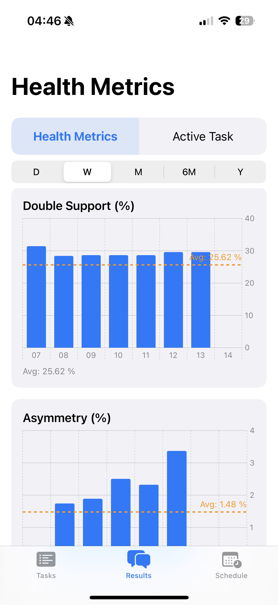
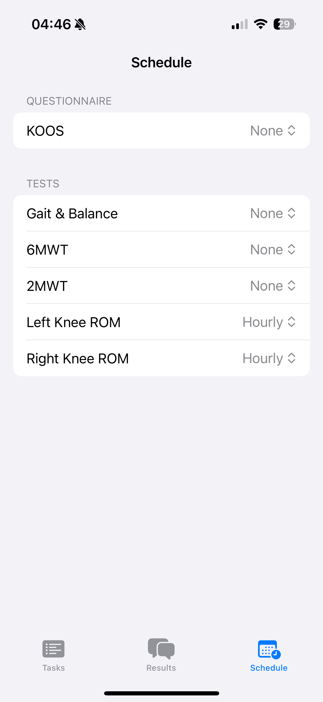

# IDM Research

A health research app built with SwiftUI, integrating HealthKit and Core Data to track and visualize key mobility and knee metrics for clinical studies.

## Features

- Track walking speed, step length, double support time, and knee range of motion
- HealthKit integration for automatic health data collection
- Core Data storage for custom task results (e.g., walking, knee ROM)
- Results tab with Health Metrics (charts, averages) and Active Task (custom results)
- Apple Health-style UI for metrics visualization
- Scheduling and reminders for tests and questionnaires

## Screenshots

### Results: Active Task

### Results: Health Metrics

### Select a Test

### Main Tasks View

### Schedule

---

> For setup instructions, see the Xcode project and dependencies in this repository.

---

© IDM Research Project
